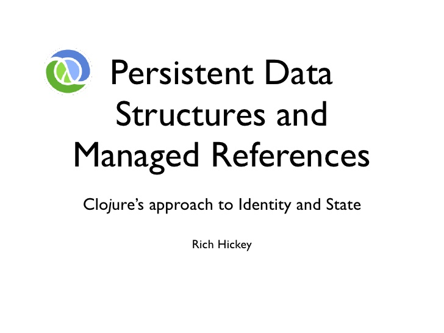
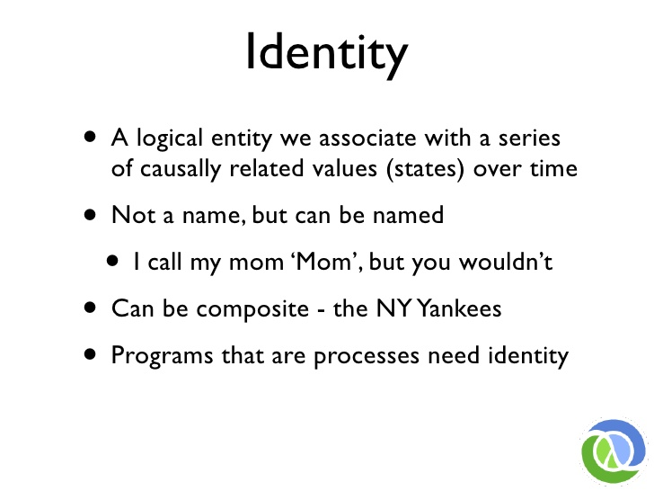

# Persistent Data Structures and Managed References

* **Speaker: Rich Hickey**
* **Conference: [QCon]() - Oct 2009**
* **Video: [http://www.infoq.com/presentations/Value-Identity-State-Rich-Hickey](http://www.infoq.com/presentations/Value-Identity-State-Rich-Hickey)**

How many people program in a functional programming language? Okey, so halfway ??? converted and not in a functional programming language, a non-functional programming language? so still a lot of that. Ah, I think this will be useful to both audiences and in particular if you're not in a functional programming language, in fact if you're not in Erlang, which I think has a complete story for how they do state, all the other functional programming languages have you know 2 aspects, they have this functional part, and then, and then, you know, Haskell has this beautiful side where the type system keeps this part pure and then there's the other part which is kind of imperative, do this do that, and then they have a bunch of constructs to make,err , provide the facility for ??? state ,on that side ? Similarly there are a lot of hybrid functional programming languages, like Scala, F#, where I think there are questions to be asked about, okey here's the pure part, what's the story about the other part. So what I want to do today is to talk about functions and processes and to distinguish the two. In fact, the core concert in this talk is it to try to parse out what we mean by identity, state and values, try to separate those concepts and see how programming with values while a really important part of the functional of your program ends up being a critical part of the non functional part of you program, the part that actually has to manage state and behaviors if things are changing, and there are two components in that one is how you represent composite objects and values. Lot of people who are new to functional programming wonder about the efficiency and representation issues there and I'll talk about that and finally I'll talk about one approach to dealing with state and change in a  program, the one that Clojure uses, which is compatible with a little bit of philosophy which I'm gonna start with.

I'm not really gonna talk about Clojure very much, how many people were in the talk yesterday. Okey, how many people who weren't know something about Clojure. Okey. This is not really a Clojure specific talk, though there'll be some code later, it shouldn't be too threatening. Just gonna summarize quickly with this one slide. What Clojure is about is it's a dynamic programming language, it's dynamically typed, it's functional in particularly, it's functional in emphasizing immutability, not just in, you know, supporting higher order functions. All the data types in Clojure are immutable. It supports concurrency  in that it's a two part story, one is you have type support for immutability and pure functions, the other part is you have to have story for when multiple things happening at a time and you're gonna have some perceptible change, and Clojure does. In fact, I think it's an important part of a language that purports to be functional to have a story about the non-functional part. Clojure is not particularly object oriented, it may be clear after listening to this talk why not, because I think as currently implemented, all of the object-oriented technologies have big problems when they face concurrency and functional programming, as I said, from a conceptual standpoint nothing about this is Clojure specific.

So what do we mean by functions, I think that there's a really easy way saying oh function is something that you call and that's not what we're talking about here, we're talking about a very precise notion of function which is something that you call that takes values as arguments and produces values as returns. When it's given the same arguments, it always produces the same values, it doesn't depend on the outside world, it doesn't affect the rest of the world. So many methods in your classes are not functions by this definition, but in particular too, I want to highlight the fact that pure functions have no notion of time. Time is gonna be a critical notion through this talk.

So what is functional programming, there are a lot of answers to this questions and I think people who are really into type system will claim a stronger arguments for what constitues functional programming. But I'm gonna limit the definition here to, you know, programming that emphasizes program with functions, so you wanna try to write as much of your program as you can with pure functions. When you do that you get a ton of benefits, they've been talking about that in other talks, it's not really the focus of this talk other than to say, even without concurrency, your program will be easier to understand, easier to reason about, easier to test, more modular and so forth. That all falls out of programming with functions to the greatest an extent as possible. On the other hand, when you step back and look at your entire program, very few programs on the whole, are functions. You know, that takes a single input and think about it and produces a single output. Maybe some compiler or theorem provers work that way, but most real world programs that I worked on, and I think most real world programs in the real world don't work that way. In particular, well, even if you claim your program is completely functional, it's gonna produce, say, outputs, it's not, coz otherwise it's just gonna warm up the machine. But, even if it's mostly functional, there's still an observable effect of a purely functional program runnning, right. It's running on a computer, as soon as it's running on a computer it's not math anymore, right? It's a program running on a computer, it's consuming memory, it's consuming clock cycles, it's observabaly doing something over time. So all programs do things over time. But most real world programs ??? actually have observable behaviors, that is not just the fact that they're running on a computer, but that they're doing things, they're interacting with the outside world, they're talking over sockets, they're putting stuff on the screen, they pulling things in and out of the database. In particular though, we use one critical measure about how to define states, which is if you ask the same question twice, and you get different answers, then there's state. I don't care where you put it, you put it in a process, you put it in an agent, you put it in an atom, you know, in a variable, doesn't matter, in a database. If you ask the same question twice and get different answers at different times, you got states. So again, the word time just came up again there.

So I think most programs are processes which means we need to talk about the part of your program that can't be purely functional, the part that's gonna have to produce different answers at different times. How do you do that, and not make a complete mess out of what you created with the shining pure part. In particular though I wanna highlight the fact that this talk is strictly about the notion of state and time in a local context, I'm talking about in the same process. There're a completely different set of requirements and characteristics of distributed programs, where you cannot do the same things that you can do in the same process. So I'm talking only about same process concurrency and state.

So I want to be a little more precise about what I mean when I say identity, state and value and these kinds of things and in particular I'm gonna talk about state and I'll talk about it twice. One is just ??? a generic statement, state is the value of an identity at a time. Maybe none of that makes sense. Maybe it sounds like a variable from a traditional programming language right? Because I think if you ask anybody who uses traditional programming language Do you have state? Yeah I have some variable, I change them and that is not a good sound definition of what constitute state. So is variable state? Do they do this job? Do they manage the value of an identity? not over time. We can have a variable i, we can set it to zero, we can set it to 42, we can asign one variable to another, right. Is j 42? That depends. In a sequential program, probably, kinda, sorta. In a program that has threads. What can go wrong? Well I didn't say what order these things happen, right? or what thread they happen in. For instances if you set j equals i in a separate thread, what bad thing could have happen to you when it is 42 not necessarily. No definitely not. Because that memory may not have been flushed through to the other thread's cache. okey, it's not volatile necessarily i. What else could happen that is bad? Maybe i is a long, maybe setting a long is not atomic in your programming language. bad.

So variables are not gonna be good enough to do the job of managing states. Alright? They predicate on a single thread of control, they actually don't work at all otherwise. They're harmly broken by concurrency, the whole notion of this is a piece of memory is, does not work, and our programs are built substantially on this, whether it's a variable sitting on the stack or a field in your object, same problems. Pieces of memory aren't sufficient abstractions. So we have the problem of non-atomicity of long, right? It is a problem in a lot of languages, it's not atomic , so you can have half a number if you look at it from another thread. Write visibility and memory fences have to be accounted for once you have multiple threads of control on a true concurrent box. If you have an object and it has a bunch of these things collected together that constitutes a state, now you have the problem of composing composite operations because making it into another valid state requires touching several of these variables things, which now makes you impose locks of some sort of synchronization that says, stay away from me, so I can pretend there's only one thread of control because that's what my language thought when they wrote it, or the language they copy thought when they wrote in. All of  these things are example of the same problem, we're having to work around the lack of a model for time. Coz there's no point to have a variable if you have no time, and just think about that for a second, if there's no time notion, why would you need a variable. If you can't go back to it later and see something different, how is that a variable?

So if you want to be clear about time, which we're not gonna be, non-physics lecture. We're just gonna say something, what do you think of when you think of time? You think of things being before or after other things, you think of something happening later, you think of something happening at the same time, you think of something happening right now, which is sort of a self-relative perspective of time. But all of these concepts are important in that they're inherently relative, right? When you think about time, there's not a lot about time that are hours or you know, this particular moment with the name on it, most of our notions on time have to do with relative time, the ordering between two discrete things.

What do we mean by value, again, here's an area where there's so much ambiguity and loose thinking, that we can't write correct program without sort of nail this down. So the core characteristic of a value is that it's immutable, right? Some values are obvious, number, we're all comfortable with that concept it's a value. But I will content that until you start thinking about composites of these things like numbers as value, you're doomed in the future. You may not have been doomed right now but at some point, it's gonna be a problem for your programs. So what went wrong? OK we all think 42 is indivisible, of course we still store it as long, it may not be depending on the language but the idea of 42 we're concerned to be atomic concept but we have a big problem in the way we think about composite objects, some of that falls out of our languages I think, you know, they have Date library where you can set the month is a crazy concept. There's not this date and that date, there's not setting the month of a date and it's another date, right away you have that problem, I set the month of a date then it's another date. If it's another date, you have two dates, you don't have one setable date. Our class library has destroyed our brain in this area. Also the default behaviours of our languages, you create a new class in most languages and everything is variable and instantly you have stateful mess that maybe you have to cleanup with a lot of disciplines on your part. So I'm gonna contend that dates, sets, maps, everything is a value and should be treated like a value, and you should separate the concept of value from the concept of change.

So one more concept
